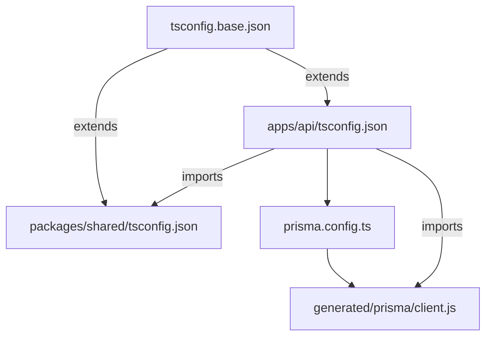

# Example: Full Scale Feature (Design-First)

> Scenario: ESM + Prisma 7 configuration spike

This example shows the three files generated for a full scale story using the design-first workflow.

---

## design.md (Phase 1)

```markdown
---
story: esm-prisma7-config
type: feature
scale: full
version: 1
created: 2026-04-01
---

# Design - ESM + Prisma 7 Configuration

## Overview

Configure the monorepo for ESM-only operation required by Prisma 7. All packages emit ESM, use Node16 module resolution, and explicit .js import extensions.

## Architecture



## Components & Interfaces

### TSConfig Base

- **Responsibility:** Shared TypeScript configuration for ESM
- **Key settings:** target ES2022, module Node16, moduleResolution Node16

### Prisma Config

- **Responsibility:** Prisma 7 generator configuration
- **Key settings:** output path to src/generated/prisma/, adapter-pg

## Testing Strategy

- **Unit tests:** N/A — configuration-only, no logic
- **Integration tests:** Cross-package import resolves at runtime, PrismaClient instantiates and executes a query
```

---

## story.md (Phase 2 — derived from design)

```markdown
---
story: esm-prisma7-config
type: feature
scale: full
version: 1
created: 2026-04-01
---

# Story - ESM + Prisma 7 Configuration

## Introduction

The monorepo must support ESM-only packages to satisfy Prisma 7's requirement. This configuration ensures all packages compile, import each other correctly, and Prisma Client generates and runs in ESM mode.

## Requirements

### R1. ESM Compilation

#### Acceptance Criteria

- R1.1: WHEN tsc --build is executed THE SYSTEM SHALL compile all packages without errors
- R1.2: WHEN a package imports from another workspace package THE SYSTEM SHALL resolve the import at runtime without ERR_REQUIRE_ESM

### R2. Prisma 7 ESM Integration

#### Acceptance Criteria

- R2.1: WHEN prisma generate is executed THE SYSTEM SHALL output the client to the configured path
- R2.2: WHEN PrismaClient is imported from the generated output path THE SYSTEM SHALL resolve the ESM import without errors
- R2.3: WHEN a query is executed against PostgreSQL THE SYSTEM SHALL return results using the pg adapter

## Constraints

- All package.json files must have "type": "module"
- Import paths must include .js extension
- Prisma 7 does not auto-generate after migrate — explicit generate required

## Out of Scope

- Prisma schema design (separate story)
- Database creation and migrations (separate story)
```

---

## tasks.md (Phase 3)

```markdown
---
story: esm-prisma7-config
type: feature
scale: full
version: 1
created: 2026-04-01
---

# Implementation Plan - ESM + Prisma 7 Configuration

## Overview

Configure TypeScript for ESM output, set up Prisma 7 with explicit config, validate cross-package imports and database connectivity. Bottom-up: TS config first, then Prisma on top.

## Task List

- [ ] 1 - TypeScript ESM Configuration
  - _Complexity: Simple | Tests: None | Risks: None | Dependencies: None_
  - Objective: Configure tsconfig for ESM output across all packages

  - [ ] 1.1 - Configure base and package tsconfigs
    - Context:
      - Files: `tsconfig.base.json` (current config to migrate)
      - Docs: TypeScript Node16 module resolution (context7)
    - Objective: Set up shared ESM configuration for all packages
    - ToDo: Update tsconfig.base.json with target ES2022, module Node16, moduleResolution Node16. Add composite: true in each package tsconfig. Update package.json files with "type": "module".
    - Validation: `tsc --build` passes, runtime import between packages works without ERR_REQUIRE_ESM
    - Requirements: R1.1, R1.2
    - Commit: "chore: configure TypeScript for ESM output"

- [ ] 2 - Prisma 7 Setup
  - _Complexity: Moderate | Tests: Integration | Risks: None | Dependencies: Task 1_
  - Objective: Configure Prisma 7 with ESM-compatible generator and pg adapter

  - [ ] 2.1 - Configure Prisma generator
    - Context:
      - Docs: Prisma 7 ESM configuration (context7)
      - Research: "Prisma 7 adapter-pg ESM setup" (perplexity)
    - Objective: Set up prisma.config.ts with ESM-compatible output
    - ToDo: Create prisma.config.ts with output path to src/generated/prisma/. Install @prisma/adapter-pg. Run prisma generate.
    - Validation: `prisma generate` succeeds, PrismaClient importable from generated path
    - Requirements: R2.1, R2.2

  - [ ] 2.2 - Validate database connectivity
    - Objective: Verify Prisma Client works end-to-end in ESM mode
    - ToDo: Write integration test that imports PrismaClient from generated path and executes a simple query against PostgreSQL.
    - Tests: Integration · `tests/prisma.test.ts` — PrismaClient instantiates, executes SELECT query, returns data via pg adapter
    - Validation: `npm test -- prisma.test.ts` passes
    - Requirements: R2.3

  - [ ] 2.3 - Commit
    - Validation: `prisma generate` clean, integration test passes
    - Commit: "feat: configure Prisma 7 with ESM and pg adapter"

## Quality Gates

- [ ] All acceptance criteria validated
- [ ] `tsc --build` succeeds across all packages
- [ ] Cross-package runtime import works without errors
- [ ] Prisma integration test executes query against PostgreSQL
```
